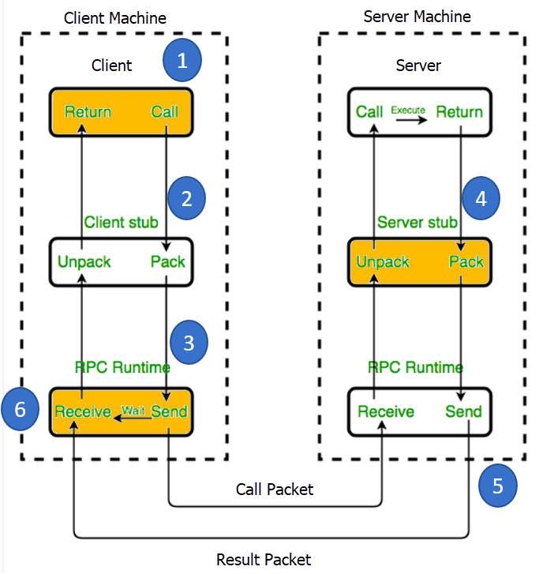
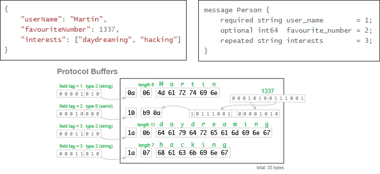
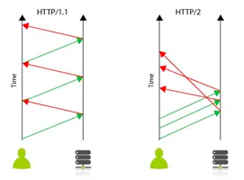
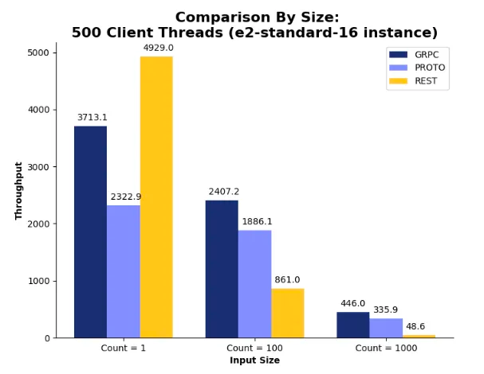

# gRPC를 이해해보자!

# RPC

*reference: https://www.guru99.com/ko/remote-procedure-call-rpc.html*
- Remote Procedure Calls의 약자
- 다른 프로세스와 통신할때 인터페이스를 사용해서 통신하는 방법(기존 REST의 경우 JSON을 이용)
- Client와 Server에 존재하는 각각의 Stub이 serialize and deserialize 역할을 수행

# gRPC 특징
- Protocol Buffer: Serialization 하여 데이터를 전달
  - 데이터 구조를 .proto 파일에 정의
  - 반면에 REST는 Serialization 없이 JSON, XML 등을 사용 -> 용량이 상대적으로 큼
  - 
  *reference: https://martin.kleppmann.com/2012/12/05/schema-evolution-in-avro-protocol-buffers-thrift.html* 
- HTTP2 사용: 특징인 Multiplexing, Header Compression 등을 사용할 수 있음
  - 반면 REST는 HTTP1.1 를 사용
  - 
  *reference:https://jumpic.com/hashtag.php?q=http2*

# 해당 레포지토리에 사용된 모듈들
- interface: gRPC에 사용되는 request, response 정의
  - grpc-protobuf 디펜던시로 패키징 하여 다른 모듈에서 사용
- server: gRPC 서버
- client: gRPC 클라이언트(한번만 호출)

# How to run
- 자바 17 사용!!
```bash
# Start gRPC server
./gradlew :server:bootRun
```

```bash
# Send a request using spring boot client 
./gradlew :client:bootRun
```

```bash
# Send a request using grpcurl
brew install grpcurl # mac
grpcurl --plaintext -d '{"name": "grpcurl"}' localhost:19090 Simple.SayHello
```
# Deep Dive
## gRPC request 
- server 모듈의 로그에서 request에 HTTP2, content-type: application/grpc 가 들어가있음을 확인할수 있음
> 2024-02-09T14:36:28.596+09:00 DEBUG 57331 --- [-worker-ELG-3-1] i.g.n.s.i.grpc.netty.NettyServerHandler  : [id: 0xe34d6c07, L:/[0:0:0:0:0:0:0:1]:19090 - R:/[0:0:0:0:0:0:0:1]:56402] INBOUND HEADERS: streamId=5 headers=GrpcHttp2RequestHeaders[:path: /Simple/SayHello, :authority: localhost:19090, :method: POST, :scheme: http, te: trailers, content-type: application/grpc, user-agent: grpcurl/1.8.9 grpc-go/1.57.0, grpc-accept-encoding: gzip] padding=0 endStream=false
- Body에서는 request message가 binary format(protobuf)으로 Serialize됨을 확인할수 있음
>'{"name": "grpcurl"}' -> length=14 bytes=00000000090a076772706375726c

> 2024-02-09T14:36:28.597+09:00 DEBUG 57331 --- [-worker-ELG-3-1] i.g.n.s.i.grpc.netty.NettyServerHandler  : [id: 0xe34d6c07, L:/[0:0:0:0:0:0:0:1]:19090 - R:/[0:0:0:0:0:0:0:1]:56402] INBOUND DATA: streamId=5 padding=0 endStream=true length=14 bytes=00000000090a076772706375726c
- Response에서 역시 message가 binary format(protobuf)으로 Serialize됨을 확인할수 있음
> '{"message":"Hello grpcurl"}' -> length=21 bytes=00000000100a0e48656c6c6f2c206772706375726c

> 2024-02-09T14:36:28.600+09:00 DEBUG 57331 --- [-worker-ELG-3-1] i.g.n.s.i.grpc.netty.NettyServerHandler  : [id: 0xe34d6c07, L:/[0:0:0:0:0:0:0:1]:19090 - R:/[0:0:0:0:0:0:0:1]:56402] OUTBOUND DATA: streamId=5 padding=0 endStream=false length=21 bytes=00000000100a0e48656c6c6f2c206772706375726c
- JSON과 비교했을때, 용량으로 보면 binary format이 더 효과적임

| Data                        | Proto buf | JSON     |
|-----------------------------|-----------|----------|
| {"name": "grpcurl"}         | 14 bytes  | 23 bytes |
| {"message":"Hello grpcurl"} | 21 bytes  | 32 bytes |

## grpcurl 사용할떄는 stub을 어떻게 할까?
- spring boot client로 요청을 보냈을때는 interface 모듈을 통해 protobuf를 추가해주었음
- 그러나 grpcurl은 stub를 만들어줄 metadata를 사전에 입력해주지 않았는데 어떻게 작동할지?
- server 모듈의 로그를 보면, API 호출 되기 전에 reflection API가 호출되었음을 확인할수있음
  - grpcurl은 내부적으로 reflection API을 사용해서 stub을 만들어냄
> *<b>Reflection API</b>*
> 
> [0:0:0:0:0:0:0:1]:19090 - R:/[0:0:0:0:0:0:0:1]:55968] INBOUND HEADERS: streamId=3 headers=GrpcHttp2RequestHeaders[:path: /grpc.reflection.v1alpha.ServerReflection/ServerReflectionInfo, :authority: localhost:19090, :method: POST, :scheme: http, te: trailers, content-type: application/grpc, user-agent: grpcurl/1.8.9 grpc-go/1.57.0, grpc-accept-encoding: gzip] padding=0 endStream=false
> 
> *<b>And then the original API</b>*
> 
> [0:0:0:0:0:0:0:1]:19090 - R:/[0:0:0:0:0:0:0:1]:55968] INBOUND HEADERS: streamId=5 headers=GrpcHttp2RequestHeaders[:path: /Simple/SayHello, :authority: localhost:19090, :method: POST, :scheme: http, te: trailers, content-type: application/grpc, user-agent: grpcurl/1.8.9 grpc-go/1.57.0, grpc-accept-encoding: gzip] padding=0 endStream=false


# REST와 비교
- Body의 용량이 적을때는 REST가 더 효율적임
  - HTTP2 혹은 Stub에서 Serialize/Deserialize의 영향?
- 그러나 Body의 용량이 커질수록 gRPC 가 더 효율적임 > Stub에서 Serialize/Deserialize의 영향으로 보임

- reference: https://medium.com/@i.gorton/scaling-up-rest-versus-grpc-benchmark-tests-551f73ed88d4

# 결론
- 데이터의 사이즈가 클때는 gRPC가 좋은 선택이 될수 있음
- 또한 gRPC를 통해 HTTP2의 Multiplexing같은 기능을 활용할수 있을듯

# References
- Deep Dive into gRPC(KR): https://medium.com/naver-cloud-platform/nbp-%EA%B8%B0%EC%88%A0-%EA%B2%BD%ED%97%98-%EC%8B%9C%EB%8C%80%EC%9D%98-%ED%9D%90%EB%A6%84-grpc-%EA%B9%8A%EA%B2%8C-%ED%8C%8C%EA%B3%A0%EB%93%A4%EA%B8%B0-1-39e97cb3460
- Calculate Json size: https://www.debugbear.com/json-size-analyzer
- Compare to REST: https://medium.com/@i.gorton/scaling-up-rest-versus-grpc-benchmark-tests-551f73ed88d4
